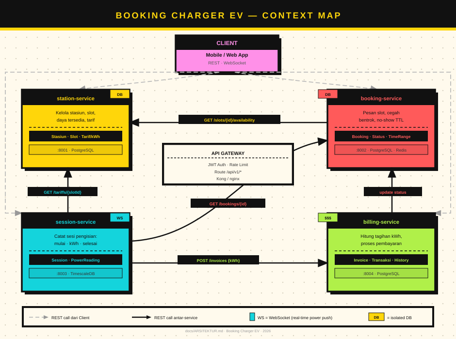
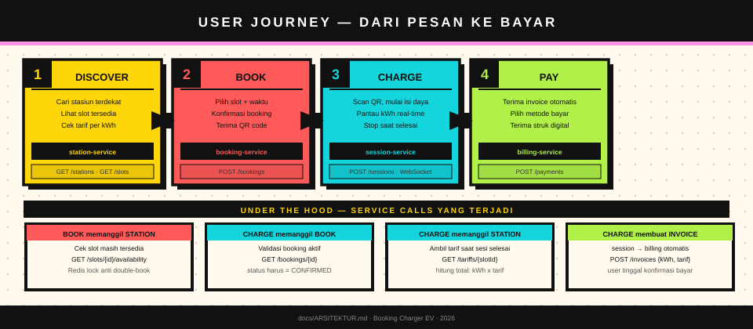
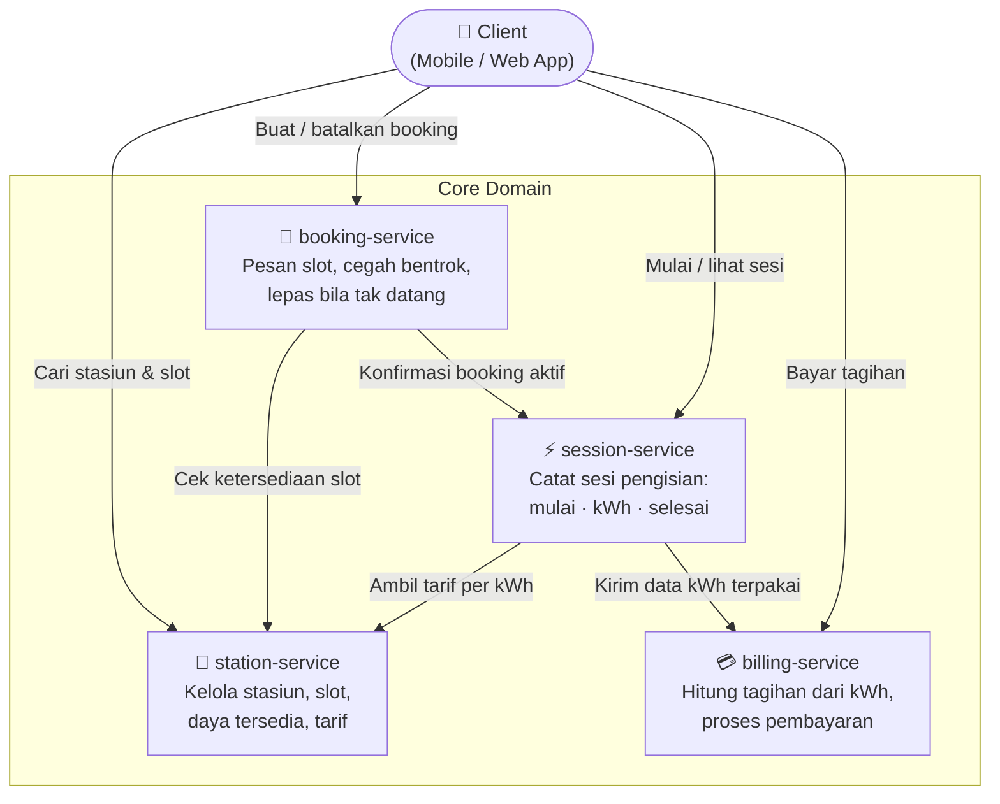
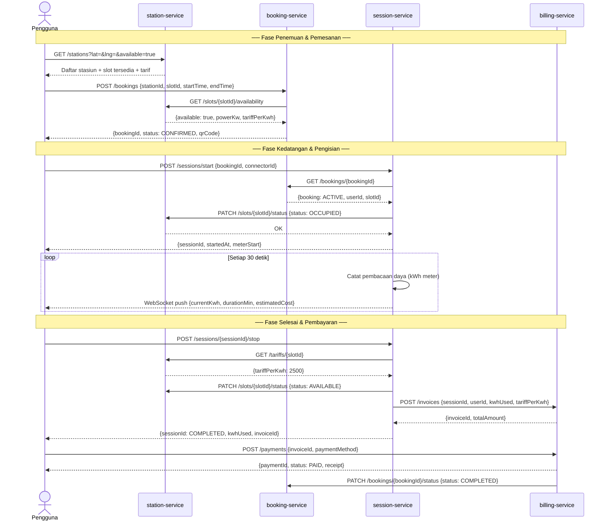
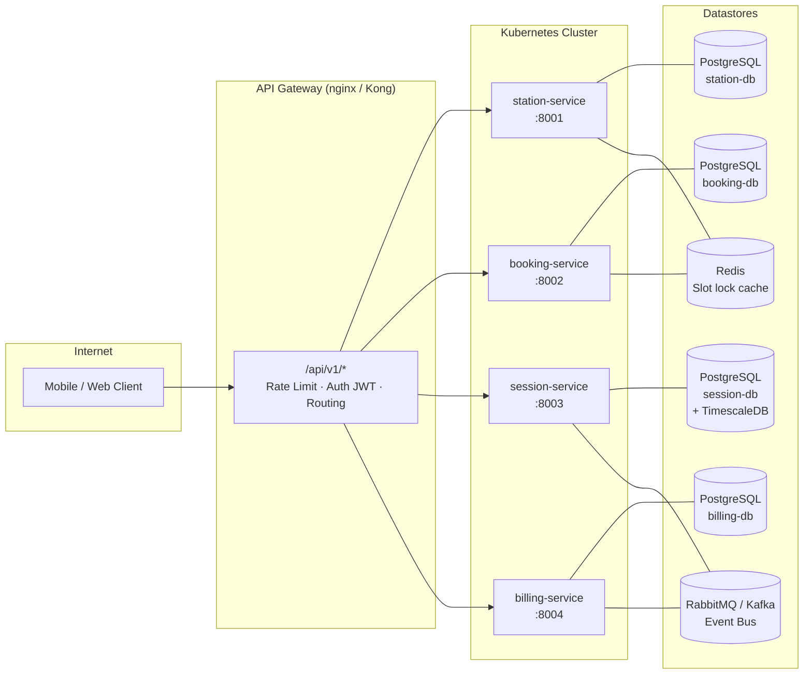

# Arsitektur Sistem — Booking Charger Kendaraan Listrik

## 1. Ringkasan

Sistem ini memungkinkan pengguna memesan slot pengisian daya EV, memantau sesi pengisian, dan membayar tagihan secara otomatis. Dirancang sebagai **empat microservice independen** yang berkomunikasi via REST (sinkron) dan Event/Message (asinkron).

---

## 2. Context Map (Peta Konteks)





Empat bounded context utama beserta arah ketergantungan:



---

## 3. Alur Sistem End-to-End



---

## 4. Data Model per Service

### station-service
```
Station        { id, name, location(lat,lng), address, totalSlots, operatorId }
Slot           { id, stationId, connectorType, powerKw, status(AVAILABLE|OCCUPIED|FAULT) }
Tariff         { id, slotId, pricePerKwh, currency, effectiveFrom }
```

### booking-service
```
Booking        { id, userId, slotId, startTime, endTime, status(PENDING|CONFIRMED|ACTIVE|COMPLETED|CANCELLED) }
NoShowJob      { bookingId, releaseAt }   ← cron job lepas slot bila tak datang +15 mnt
```

### session-service
```
Session        { id, bookingId, userId, slotId, startedAt, endedAt, meterStart, meterEnd, kwhUsed }
PowerReading   { id, sessionId, recordedAt, cumulativeKwh, powerW }
```

### billing-service
```
Invoice        { id, sessionId, userId, kwhUsed, tariffPerKwh, subtotal, tax, total, status(PENDING|PAID|FAILED) }
Transaction    { id, invoiceId, paymentMethod, gateway, gatewayRef, paidAt, amount }
PaymentHistory { id, userId, invoiceId, action, createdAt }
```

---

## 5. Pola Komunikasi

| Pengirim | Penerima | Metode | Endpoint / Event |
|---|---|---|---|
| booking-service | station-service | REST GET | `/slots/{id}/availability` |
| session-service | booking-service | REST GET | `/bookings/{id}` |
| session-service | station-service | REST GET/PATCH | `/tariffs/{slotId}`, `/slots/{id}/status` |
| session-service | billing-service | REST POST | `/invoices` |
| billing-service | booking-service | REST PATCH | `/bookings/{id}/status` |
| session-service | client | WebSocket | `session.{sessionId}.power` |

> **Prinsip:** Komunikasi sinkron (REST) hanya untuk operasi yang membutuhkan respons langsung. Notifikasi status non-kritis menggunakan event bus (lihat ADR-002).

---

## 6. Deployment View



---

## 7. Konsistensi Desain — Design Principles

### 7.1 API Contract
- Semua endpoint menggunakan **REST JSON**, versioned: `/api/v1/`
- Response envelope standar:
  ```json
  { "data": {}, "meta": { "requestId": "", "timestamp": "" }, "error": null }
  ```
- Error menggunakan RFC 7807 Problem Details:
  ```json
  { "type": "/errors/slot-unavailable", "title": "Slot not available", "status": 409, "detail": "..." }
  ```

### 7.2 Naming Convention
| Konteks | Konvensi |
|---|---|
| REST path | `kebab-case`, noun plural: `/charging-sessions` |
| JSON field | `camelCase` |
| Database column | `snake_case` |
| Event name | `SCREAMING_SNAKE_CASE`: `SESSION_COMPLETED` |
| Service name | `kebab-case`: `billing-service` |

### 7.3 Database Isolation
- Setiap service memiliki **database sendiri** — tidak ada shared table
- Cross-service data diakses hanya via API, tidak via JOIN lintas DB

### 7.4 Idempotency
- `POST /bookings` menggunakan `Idempotency-Key` header
- `POST /sessions/start` idempoten terhadap `bookingId`

### 7.5 Slot Locking
- Gunakan **Redis SETNX** dengan TTL 5 menit saat booking dimulai untuk mencegah race condition double-booking

---

## 8. Referensi ADR

| No | Judul | Status |
|---|---|---|
| [ADR-001](adr/ADR-001-microservice-decomposition.md) | Dekomposisi menjadi 4 Microservice | Accepted |
| [ADR-002](adr/ADR-002-komunikasi-antar-service.md) | Pola Komunikasi REST + Event Bus | Accepted |
| [ADR-003](adr/ADR-003-database-per-service.md) | Database Isolation per Service | Accepted |
| [ADR-004](adr/ADR-004-slot-locking-redis.md) | Slot Locking dengan Redis | Accepted |
